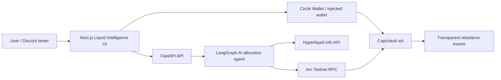

# ArcMind

ArcMind is a submission for **RFB 06: Social Trading Intelligence** in the Agora Agents Hackathon. It is an AI copy-trading intelligence platform for Arc, Circle USDC, and Hyperliquid social leaders.

The core idea is simple: do not blindly copy traders. ArcMind scores leaders, allocates capital dynamically, monitors degradation, exits weak strategies, and publishes transparent rebalance decisions on-chain.

## What Is Included

- `contracts/` - Solidity 0.8.26 Foundry vault for USDC deposits and agent-published allocations.
- `backend/` - FastAPI + LangGraph agent that fetches Hyperliquid data, scores traders, and returns structured JSON decisions.
- `frontend/` - Next.js 15 App Router UI with Tailwind, wagmi, viem, Recharts, and a premium Liquid Intelligence design.
- `scripts/` - Convenience scripts for Arc deployment and local demo startup.

## Architecture



## AI Agent

The agent attempts to fetch real Hyperliquid data from:

```text
https://api.hyperliquid.xyz/info
```

It then calculates:

- Sharpe-like risk-adjusted return
- Calmar-like drawdown efficiency
- Consistency and win-rate quality
- Liquidity capacity
- Strategy degradation from drawdown, volatility, and declining reliability

The output is structured JSON:

- traders to follow
- allocation weights in basis points
- expected edge
- risk score
- exits and reduction decisions
- rationale and decision hash

If Hyperliquid or API keys are unavailable during judging, the backend falls back to curated demo data so the product remains usable.

## Arc + Circle

ArcMind is designed for Arc Testnet:

```text
RPC: https://rpc.testnet.arc.network
Chain ID: 5042002
ArcMindVault: 0x3245A7072CD720c16Eaa5c762Bd292A7Fe5Cf9CF
```

Circle usage:

- USDC is the vault asset.
- The user flow is built around depositing testnet USDC.
- `CopyVault` stores a `circlePaymaster` address so the deployment can point to Circle Paymaster infrastructure.
- Frontend copy and user flow are Paymaster-ready: connect wallet, approve USDC, deposit, and let periodic AI rebalances update strategy state.
- The app is structured to support Circle Wallets / App Kit integration where available in the hackathon environment.

## Smart Contract

`CopyVault.sol` supports:

- USDC deposits and withdrawals
- share accounting
- owner-managed agent address
- periodic agent rebalance publishing
- allocation storage
- decision hash anchoring
- events for deposits, withdrawals, agent updates, and rebalances

The vault intentionally separates allocation intent from exchange execution adapters. That makes the hackathon demo transparent and easy to audit, while leaving a clean integration point for production trade execution.

## Local Setup

### 1. Backend

```bash
cd backend
python -m venv .venv
. .venv/bin/activate
pip install -r requirements.txt
cp .env.example .env
uvicorn app.main:app --reload --port 8000
```

Health check:

```bash
curl http://localhost:8000/health
```

Main endpoints:

```text
GET  /api/dashboard
GET  /api/leaders
GET  /api/agent/latest
POST /api/agent/run
```

### 2. Frontend

```bash
cd frontend
npm install
cp .env.example .env.local
npm run dev
```

Open:

```text
http://localhost:3000
```

Pages:

- `/` - Landing page
- `/dashboard` - AI portfolio command center
- `/leaders` - Hyperliquid leader scoring
- `/strategy` - Agent decisions and exit logic
- `/performance` - AI vs blind copy comparison

### 3. Contracts

Install Foundry, then:

```bash
cd contracts
forge install foundry-rs/forge-std
forge test
```

Deploy to Arc Testnet:

```powershell
.\scripts\deploy-arc.ps1 `
  -PrivateKey "0x..." `
  -UsdcAddress "0x..." `
  -AgentAddress "0x..." `
  -CirclePaymasterAddress "0x..."
```

## Getting Testnet USDC

For the demo flow:

1. Connect a wallet configured for Arc Testnet.
2. Get Arc testnet funds from the hackathon faucet or Discord instructions.
3. Get testnet USDC from Circle faucet or the hackathon-provided USDC distribution channel.
4. Add `USDC_ADDRESS` and `ARCMIND_VAULT_ADDRESS` to `backend/.env` and `frontend/.env.local`.
5. Deposit USDC into the vault from the dashboard.

## Demo Script

1. Open the landing page and introduce ArcMind as intelligent copy trading, not mirror trading.
2. Go to Dashboard and show TVL, confidence, AI return vs blind copy, and current allocations.
3. Go to Leaders and show Hyperliquid scoring signals.
4. Go to Strategy and explain periodic rebalancing, degradation detection, and exits.
5. Go to Performance and show why AI allocation beats blind equal-weight copying.
6. Show the smart contract event model and decision hash anchoring.

## Environment Variables

Backend:

```text
ARC_RPC_URL=https://rpc.testnet.arc.network
ARCMIND_VAULT_ADDRESS=0x3245A7072CD720c16Eaa5c762Bd292A7Fe5Cf9CF
USDC_ADDRESS=
AGENT_PRIVATE_KEY=
ANTHROPIC_API_KEY=
GROQ_API_KEY=
AI_PROVIDER=deterministic
CORS_ORIGINS=http://localhost:3000
```

Frontend:

```text
NEXT_PUBLIC_API_URL=http://localhost:8000
NEXT_PUBLIC_ARCMIND_VAULT_ADDRESS=0x3245A7072CD720c16Eaa5c762Bd292A7Fe5Cf9CF
NEXT_PUBLIC_USDC_ADDRESS=
```

## Judging Highlights

- Agentic sophistication: autonomous selection, weighting, degradation detection, and exits.
- Traction: test-user flow is simple: connect, approve USDC, deposit, follow AI strategy.
- Circle alignment: USDC vault asset, Paymaster-ready UX, Circle Wallet/App Kit pathway.
- Arc alignment: EVM contracts and Arc Testnet RPC.
- Product quality: premium dark Liquid Intelligence UI, responsive pages, charts, and clear demo surfaces.
