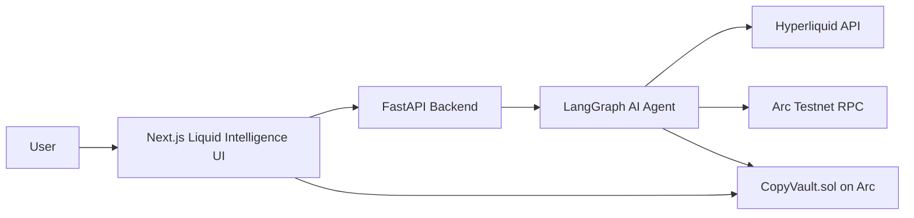

# ArcMind

**Intelligent AI Copy Trading Agent**  
**Submission for RFB 06: Social Trading Intelligence** — Agora Agents Hackathon 2026

ArcMind enables users to move beyond blind copy-trading. It uses AI to intelligently **select** traders, **allocate** capital dynamically, **monitor** performance, and **rebalance** portfolios automatically on Arc Testnet.

## What is ArcMind?

ArcMind is an AI-powered Social Trading Intelligence platform that actively manages copy-trading strategies. Instead of blindly following top leaders, the AI analyzes performance, detects strategy degradation, and makes risk-adjusted allocation decisions — all settled transparently on Arc with USDC.

## Key Features

- **Smart Trader Selection** using risk-adjusted metrics (Sharpe, drawdown, consistency)
- **Dynamic Portfolio Allocation** based on user risk profile
- **Strategy Degradation Detection** with automatic exits or reductions
- **On-chain Rebalancing** via `CopyVault.sol` on Arc Testnet
- **Clear Performance Comparison** — AI Copy vs Blind Copy
- **User Control** — Pause strategy and Emergency Withdraw at any time

## Tech Stack

- **Blockchain**: Arc Testnet (EVM) with Circle USDC
- **Smart Contracts**: Solidity 0.8.26 + Foundry (`CopyVault.sol`)
- **Backend**: Python + FastAPI + LangGraph
- **AI**: Claude 3.5 Sonnet / Groq (structured JSON decisions)
- **Frontend**: Next.js 15 + Tailwind CSS + shadcn/ui + Recharts
- **Wallet & Gas**: wagmi + viem + Circle Paymaster (gas paid in USDC)

## Architecture



## Project Structure

```
arcmind/
├── contracts/          # Solidity smart contracts (CopyVault)
├── backend/            # FastAPI + LangGraph AI agent
├── frontend/           # Next.js 15 frontend
├── scripts/            # Deployment and utility scripts
└── README.md
```

## Live Demo

- **Live URL**: [Insert your deployed link here]
- **Video Demo**: [Insert Loom/YouTube link here — max 3 mins]

## Local Setup

### 1. Backend
```bash
cd backend
python -m venv .venv
source .venv/bin/activate
pip install -r requirements.txt
cp .env.example .env
uvicorn app.main:app --reload --port 8000
```

### 2. Frontend
```bash
cd frontend
npm install
cp .env.example .env.local
npm run dev
```

Open: `http://localhost:3000`

### 3. Smart Contracts (Foundry)
```bash
cd contracts
forge install
forge test
```

## Getting Testnet USDC

Use the official Circle Faucet: [https://faucet.circle.com/](https://faucet.circle.com/) → Select **Arc Testnet**

## Key Addresses (Arc Testnet)

- **CopyVault**: `0x3245A7072CD720c16Eaa5c762Bd292A7Fe5Cf9CF`
- **RPC**: `https://rpc.testnet.arc.network`